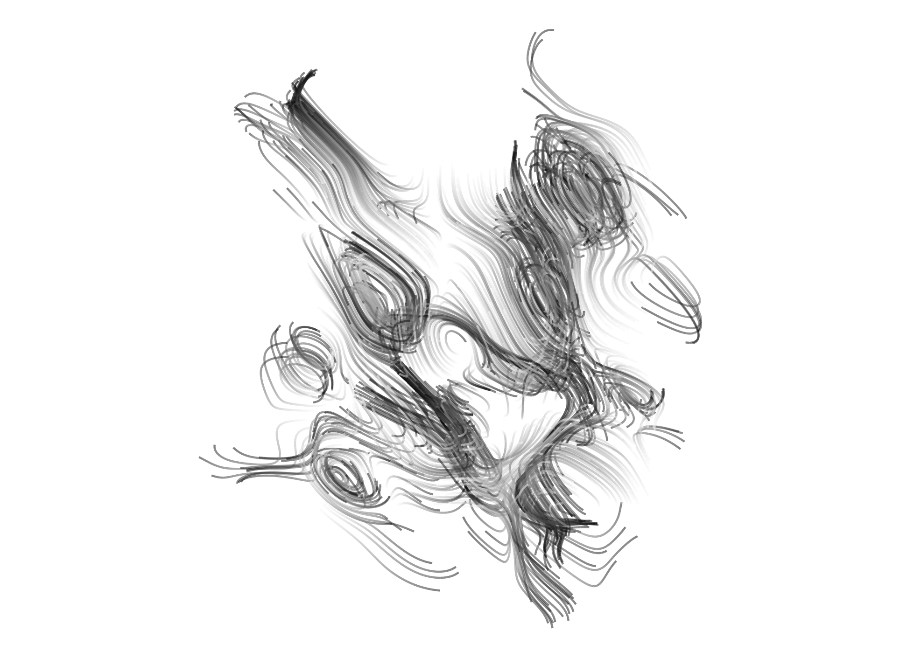

<!-- README.md is generated from README.Rmd. Please edit that file -->

```{r, include = FALSE}
knitr::opts_chunk$set(
  collapse = TRUE,
  comment = "#>"
)
```

# aRt

Este repositorio incluye una serie de scripts que utilizan paquetes y código de [Danielle Navarro](https://djnavarro.net/) para generar arte usando R. 

* [flametree](https://github.com/djnavarro/flametree)
* [stoneskip](https://github.com/djnavarro/stoneskip)
* [vorinoise](https://github.com/djnavarro/voronoise)
* [scrawl](https://github.com/djnavarro/scrawl)
* [jasmines](https://github.com/djnavarro/jasmines)

